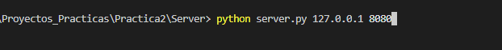

# Manual de Uso de Servidor de Pruebas

## Código de Servidor
* El servidor funciona reciviendo cadenas y aun no hace la comprobación de la cadena de JSON ya que solo es de pruebas, la idea es solamente poder ver que la comunicación de sockets funcione

* Cabe resaltar que lo que se envíe que no sea un true o falso hará el reenvío a los clientes conectados para que obtengan la cadena.

### ¿Cómo utilizar el código?

1. Clonar el repositorio utilizando el comando:
```bash
$ git clone https://github.com/ricardcutzh/EDD_Servidor_Cliente.git
```

2. En el repositorio existen dos archivos, server.py y client.py

3. Para ejecutar el codigo del servidor se debe de correr el siguiente comando (cabe resaltar que funciona para python 3)

```bash
$ python server.py IP_DEL_SERVIDOR PUERTO_ESCUCHAR
```
* IP_DEL_SERVIDOR: En el caso de sus pruebas es la ip loopback de la pc es decir: 127.0.0.1 
* PUERTO_ESCUCHAR: Pueden utilizar cualquier puerto, les recomiendo 8080

4. Inmediatamente el servidor estara listo para escuchar conexiones entrantes

#### Screenshots



## Código de Cliente
* El codigo de cliente solamente recive y manda una cadena que recibe de entrada del teclado, en lugar de enviar la entrada del teclado deben de mandar la cadena generada del bloque, o un true o false segun sea el caso.

* La parte importante es el ciclo while infinito que esta en el codigo:
```python
while True:

	# maintains a list of possible input streams
	read_sockets = select.select([server], [], [], 1)[0]
	import msvcrt
	if msvcrt.kbhit(): read_sockets.append(sys.stdin)

	for socks in read_sockets:
		if socks == server:
			message = socks.recv(2048)
			print (message.decode('utf-8'))
		else:
			message = sys.stdin.readline()
			server.sendall(message.encode('utf-8'))
			sys.stdout.write("<You>")
			sys.stdout.write(message)
			sys.stdout.flush()
```
* En esta parte del codigo comprueba si recibio un mensaje del servidor, y si lo recibe entonces lo imprime en consola, en este caso lo que deben de hacer es ver que si recibe una cadena JSON la deben de procesar y hacer las comprobaciones necesarias:

```python
if socks == server:
	message = socks.recv(2048)
	print (message.decode('utf-8'))
```

* En otro caso que necesite enviar un mensaje al servidor entra la parte del ELSE, en este caso lee un mensaje de la entrada del teclado y con el metodo sendall, manda la cadena, en lugar de leer la entrada deben de enviar el bloque generado de entrada (JSON):
```python
else:
	message = sys.stdin.readline()
	server.sendall(message.encode('utf-8'))
	sys.stdout.write("<You>")
	sys.stdout.write(message)
	sys.stdout.flush()
```

* Como pueden observar el uso es bastante sencillo, por lo que no deberia de haber problema al respecto. Tomen en cuenta que el ciclo while debe de ser ejecutado en un hilo para que continue escuchando y aun asi puedan navegar en las opciones de reportes.

### ¿Cómo correr el código?

1. Deben de proporcionar al cliente la IP y el puerto, pueden colocarlo en el codigo o como parametros antes de ejecutar el script, la IP y PUERTO son los del servidor al que el cliente se quiere conectar

```bash
$ python client.py 127.0.0.1 8080
```
